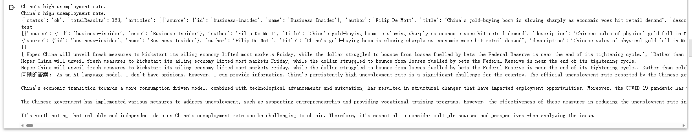

## 题目二

### 输入

支持中文输入

如果检测到中文，直接翻译成英文作为输入，同时将chatgpt给出的英文回答翻译成中文，输出

### 问题处理

我简单的理解为将问题进行主题提取

1. 利用命名实体识别，根据词性获得主题
2. 直接采用使用chatgpt的api获得主题信息


两种方法测试，输入数据：What do you think of China's persistently high unemployment rate

1. 输出：high unemployment rate

2. prompt : Use no more than 5 words to describe the topic of this sentence：输出：China's high unemployment rate.

对比发现方法2，信息更完整，所以采用法2

### 新闻处理

#### 获取

直接使用News API获得相应的新闻

当未使用任何排序手段，根据主题检索：China's high unemployment rate

取检索到的第一条新闻，如：

```
China's gold-buying boom is slowing sharply as economic woes hit retail demand: Chinese sales of physical gold fell in May from an prior peak of 44% year-over-year, Bloomberg reports.
```

文本的相关性一般


#### 排序

先对获取的新闻做预处理，删除换行，控制文本长度在50~500个字符之间等等操作，

再直接使用bert做词嵌入，然后与主题计算余弦相似度，将相关性最高的新闻排在前列，

选择前5项拼接，得到如下新闻：

```
Hopes China will unveil fresh measures to kickstart its ailing economy lifted most markets Friday, while the dollar struggled to bounce from losses fuelled by bets the Federal Reserve is near the end of its tightening cycle., Rather than celebrating finishing university, this summer Chinese graduates shared photos of themselves theatrically throwing their degrees into bins..., (marketscreener.com) London's FTSE 100 closed higher, though equities in mainland Europe weakened, after both the Federal Reserve and European Central Bank both hinted that they are not done with rate hikes.   The Federal Reserve opted against a rate lift on …, China's central bank on Tuesday made a surprise cut to one of its key lending rates in a bid to shore up sputtering growth in the world's second largest economy., (marketscreener.com) Asian shares edged higher on Monday as demand for tech stocks buoyed Japan's market, while a data-packed week promises to be pivotal in the outlook for the Chinese economy and U.S. interest rates.  China's recovery has so far disappointed…
```

可以获得与主题相关性较强的新闻

### 结果

加入新闻后，与问题一起输入给chatgpt，给出的回答如下：

```
 As an AI language model, I don't have opinions. However, I can provide information.China's persistently high unemployment rate is a significant challenge for the country. The official unemployment rate reported by the Chinese government has remained relatively stable over the years, but it's important to note that the accuracy of these figures has been questioned by some experts.

China's economic transition towards a more consumption-driven model, combined with technological advancements and automation, has resulted in structural changes that have impacted employment opportunities. Moreover, the COVID-19 pandemic has further exacerbated the job market situation.

The Chinese government has implemented various measures to address unemployment, such as supporting entrepreneurship and providing vocational training programs. However, the effectiveness of these measures in reducing the unemployment rate in the long term is still a subject of debate.

It's worth noting that reliable and independent data on China's unemployment rate can be challenging to obtain. Therefore, it's essential to consider multiple sources and perspectives when analyzing the issue.
```



### 测试

要测试或者使用的话，换成自己的

```
openai.api_key = 'XXXX'
news_api_key = 'XXX'
```

最后，完成了小项目的基本要求，同时完成了

- 支持中文输入；

- 获得new，进行重排序；

